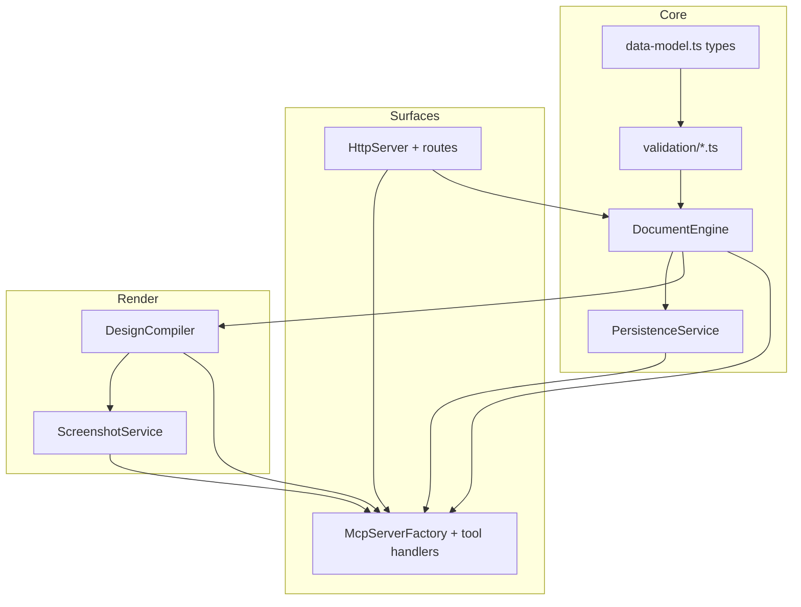

# Headless Figma Clone — Engineering Design

This folder is the **normative implementation specification** for the headless Figma clone. It translates the product PRD ([`../prd/`](../prd/index.md)) into concrete types, module boundaries, algorithms, wire formats, and verification steps so an implementation engineer does not need to invent behavior.

## How to use these documents

1. Read [Overview and normative decisions](./overview.md) first (transport, ID scheme, metadata format, transactional rules).
2. Follow the dependency order in the diagram below for implementation.
3. Use [Nine-phase implementation and testing plan](./implementation-plan-phases.md) as the delivery checklist; it links to manual MCP procedures and automated tests.

## Document map

| Document | Contents |
|----------|----------|
| [Overview and normative decisions](./overview.md) | Goals, exclusions, **fixed product choices** (MCP transport default, ID format, paths, determinism) |
| [Repository layout and packages](./repository-layout.md) | Suggested `src/` tree, public API surface, build outputs |
| [Configuration and environment](./configuration.md) | Env vars, config file schema, defaults (host, port, workspace, timeouts) |
| [Data model (TypeScript types)](./data-model.md) | File envelope, nodes, paints, effects, discriminated unions, versioning |
| [Document engine](./document-engine.md) | In-memory graph, validation, transactions, ID assignment, `use_figma` dispatch, pseudocode |
| [Persistence](./persistence.md) | Atomic save/load, `schemaVersion`, migrations, corruption handling |
| [MCP server layer](./mcp-layer.md) | SDK usage, tool registration, request context, error mapping |
| [Tool input/output schemas](./tools-schemas.md) | JSON shapes per tool; `use_figma` operation union |
| [HTTP host](./http-host.md) | `/health`, MCP route, static asset hosting (phase 3+) |
| [Rendering and screenshot pipeline](./rendering-pipeline.md) | Compiler interfaces, CSS/HTML/SVG rules, Playwright flow, pseudocode |
| [Bounding boxes and layout resolution](./layout-and-bounds.md) | Order of passes, rotation, Phase 4 layout resolution hooks |
| [Observability, errors, and logging](./observability.md) | Structured logs, error codes, warnings array |
| [Security (local service)](./security.md) | `upload_assets`, bind address, path traversal |
| [Automated testing](./testing.md) | Test matrix, fixtures, golden screenshots, required suites, `node --test` command |
| [Nine-phase implementation and testing plan](./implementation-plan-phases.md) | Per-phase code deliverables, exit criteria, automated + manual verification |

See also: [`../../tests/README.md`](../../tests/README.md) for running **Layer A** tests today.

## Implementation dependency graph

## PRD traceability

| PRD | Design coverage |
|-----|-------------------|
| [Vision and scope](../prd/vision-and-scope.md) | [Overview](./overview.md) |
| [Technical architecture](../prd/technical-architecture.md) | [HTTP host](./http-host.md), [MCP layer](./mcp-layer.md), [Document engine](./document-engine.md), [Rendering](./rendering-pipeline.md) |
| [Document model](../prd/document-model.md) | [Data model](./data-model.md), [Persistence](./persistence.md) |
| [MCP tools](../prd/mcp-tools.md) | [Tools schemas](./tools-schemas.md), [MCP layer](./mcp-layer.md) |
| [Rendering and screenshots](../prd/rendering-and-screenshots.md) | [Rendering pipeline](./rendering-pipeline.md), [Layout and bounds](./layout-and-bounds.md) |
| [Non-functional requirements](../prd/non-functional-requirements.md) | [Persistence](./persistence.md), [Security](./security.md), [Testing](./testing.md), [Observability](./observability.md) |

## Source of truth

If the PRD and this design ever disagree on product intent, **the PRD wins** and this design must be updated. If this design is silent where the PRD requires behavior, treat that as a specification bug: extend this design rather than guessing.
