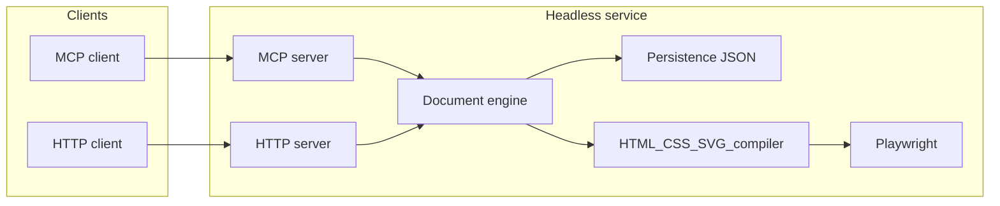

# Technical architecture

[← PRD index](./index.md)

## High-level system

The product is a **single-process** (default) Node.js application composed of:

1. **HTTP host** — health and optional REST hooks for debugging; may also serve MCP transport depending on transport choice.
2. **MCP server** — registers tools per [MCP tools specification](./mcp-tools.md); implemented with `@modelcontextprotocol/sdk`.
3. **Document engine** — authoritative in-memory **document graph** mirroring the **phased** Figma Design subset in [document model](./document-model.md); validates mutations; assigns ids. **Rejects or omits** excluded Plugin API domains per [vision and scope](./vision-and-scope.md) (NG6–NG11): Dev Mode, prototyping, video/`VideoPaint`, remote libraries, `EMBED`, `LINK_UNFURL`, plugin persistence metadata.
4. **Persistence layer** — serializes the graph to JSON on disk ([document model](./document-model.md)).
5. **Render pipeline** — **HTML / CSS / inline SVG** compiler + **Playwright** screenshotter ([rendering and screenshots](./rendering-and-screenshots.md)).

## Execution model

- **Active file context**: MCP tool handlers operate on a **current file** handle (path or internal id). Phase 1 may use a single global active file; later phases may support multiple open files with explicit parameters.
- **Mutations**: `use_figma` (and write-capable helpers) apply **transactional batches**: validate → mutate graph → persist → return summary. Partial application on error is forbidden unless explicitly documented.
- **Reads**: `get_metadata` and `get_design_context` are read-only; `get_screenshot` triggers render but must not mutate design state.

## HTTP surface (minimum)

| Route | Method | Purpose |
|-------|--------|---------|
| `/health` | GET | Liveness (see FR-PLAT-003 in [functional requirements](./functional-requirements.md)) |

Additional routes (for example static asset hosting for image fills) are **Should** in Phase 3+ and should be documented when added.

## MCP transport

Choose one primary transport for v1 and document it in the implementation readme (not duplicated as normative prose here):

- **Stdio**: simplest for local CLI agents spawning the process.
- **Streamable HTTP**: aligns with “embedded HTTP server” hosting MCP alongside `/health`.

The PRD does not mandate one; **Phase 1** must pick one and keep the other as a follow-up if needed.

## Alignment with Figma’s mental model

- Figma files are **node trees** rooted at a document with **pages** (see Plugin API overview in `docs/figma-plugin-api/docs/plugins/accessing-document.md`). This product follows the same logical hierarchy in JSON.
- Property edits follow Figma’s **replace whole property** pattern for complex fields (fills, effects); the engine should centralize cloning/normalization to avoid subtle mutation bugs (see `editing-properties.md` in bundled docs).

## Technology constraints

- **TypeScript** throughout the service code.
- **Playwright** for headless Chromium (or equivalent) for screenshots.
- **No** editor UI bundle requirement; server-side only.

## Security notes (local)

- Treat **`upload_assets`** and any user-supplied URLs as **untrusted**: validate MIME/size, store outside executable paths, sanitize filenames.
- When serving HTTP MCP, bind to **localhost** by default; document how to expose securely if needed.

## Related documents

- [Vision and scope](./vision-and-scope.md)
- [Document model](./document-model.md)
- [MCP tools specification](./mcp-tools.md)
- [Non-functional requirements](./non-functional-requirements.md)
